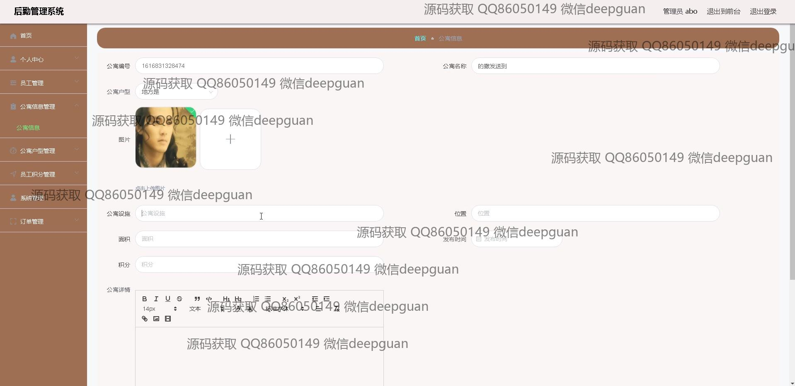
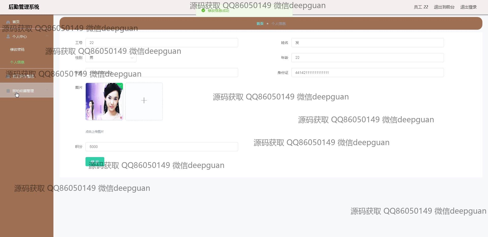
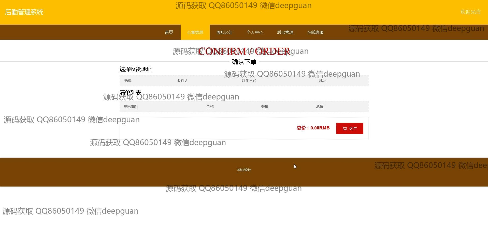
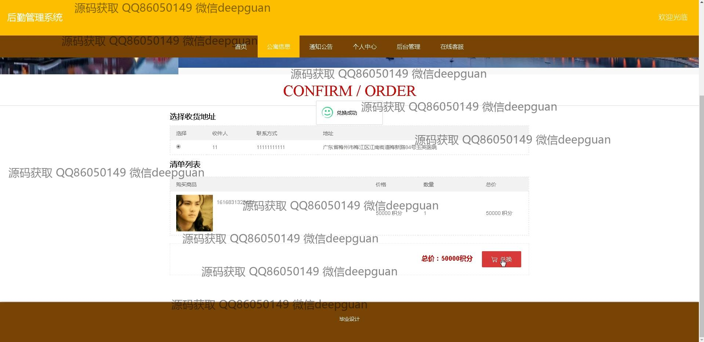

<h1 align="center">的企业公寓宿舍后勤管理网站vue</h1>

## 简介
企业公寓宿舍后勤管理系统：角色分为管理员和员工；功能包括个人中心、员工管理、公寓信息管理、订单管理、积分管理、公告通知、地址管理及在线客服。    --计算机毕业设计源码；毕设源码；java毕业设计源码

## 联系方式

<h3 align="center">获取完整代码与数据库文件 + 微信：deepguan QQ: 86050149 QQ群: 783742310</h3>

<h3 align="center">可帮忙远程部署 包运行成功！提供远程部署、修改代码、设计文档指导、代码讲解等服务！</h3>

## 功能介绍（完整见运行截图）
管理员：基本功能包括登录、注册和退出。首页提供主导航栏，涵盖公寓信息、公告信息、后台管理和在线客服等模块。管理员可以管理通知公告、员工信息、公寓信息以及订单管理。系统支持上传图片、富文本编辑等功能，用于详细描述和管理公寓细节信息。管理员可通过员工积分管理模块查看、记录、编辑员工积分信息，通过公告信息模块编辑和发布公告。管理员能访问和操作员工管理、公寓户型管理和系统管理等。

员工：基本功能包括登录、注册和退出。登录后，员工可以访问个人中心查看和修改个人信息，包括工号、姓名、性别、年龄、手机、身份证和积分。员工可以通过系统管理模块申请查看公寓相关信息，进行积分兑换和订单确认等操作。个人中心还提供我的订单、我的地址和我的收藏管理功能，员工能够查看订单状态、选择和管理收货地址以及收藏的公寓信息。员工积分管理模块则是为了方便员工查看个人积分和兑换记录。

## 运行截图

本代码来源于网络,仅供学习参考使用!

